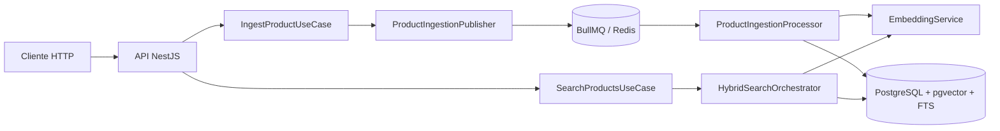

# Arquitetura

## Objetivo
Fornecer um backend pronto para produção para ingestão de produtos e busca híbrida usando recuperação semântica (pgvector) + recuperação lexical (PostgreSQL FTS), com fusão por RRF.

## Camadas

### Domain
- Entidade `Product`
- Contratos:
  - `SearchRepository`
  - `EmbeddingService`
  - `ProductIngestionJobPublisher`

### Application
- `IngestProductUseCase`
- `SearchProductsUseCase`
- `HybridSearchOrchestrator`
- `RrfService`

### Infrastructure
- Adaptadores de banco e fila:
  - `PostgresService`
  - `ProductWriteAdapter`
  - `PgVectorAdapter`
  - `PostgresFTSAdapter`
  - `EmbeddingAPIAdapter`
  - `ProductIngestionPublisher`

### Presentation
- `ProductController`
- `SearchController`

### Workers
- `ProductIngestionProcessor`
- bootstrap do worker em `main.worker.ts`

## Direção de Dependências
- Domain não depende de framework nem de infraestrutura.
- Application depende de interfaces do domínio, não de implementações concretas.
- Infrastructure implementa os contratos do domínio.
- Presentation e workers dependem apenas da composição aplicação/infraestrutura.

## Diagrama do Sistema

