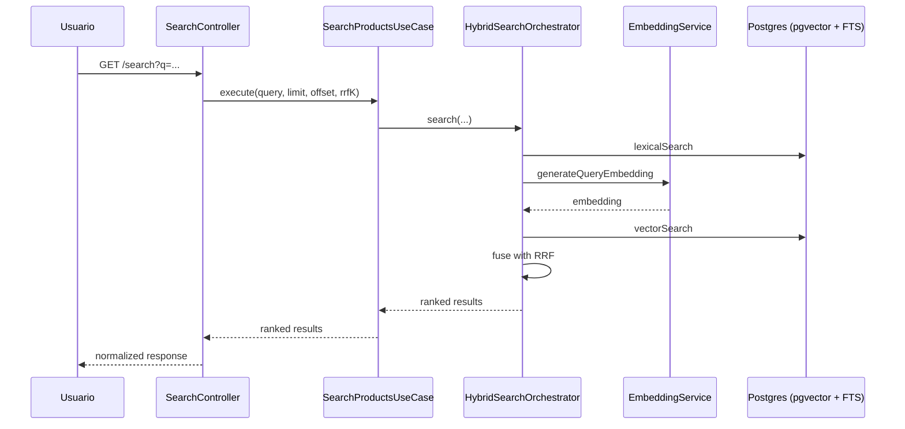

# Busca Híbrida e RRF

## Estratégia de Recuperação
O sistema executa dois métodos por consulta:
1. Recuperação semântica com pgvector (`embedding <=> query_vector`)
2. Recuperação lexical com PostgreSQL FTS (`search_vector @@ plainto_tsquery`)

Os top-k de cada método são fusionados por Reciprocal Rank Fusion (RRF).

## Fórmula do RRF
Para cada item na posição `r`:

`score = 1 / (k + r)`

A pontuação final é a soma das contribuições das listas semântica e lexical.

## Fluxo da Busca

## Fallback
Se a geração de embedding da query falhar:
- retorna somente resultados lexicais
- mantém o mesmo formato de resposta
- `semanticScore` fica ausente
