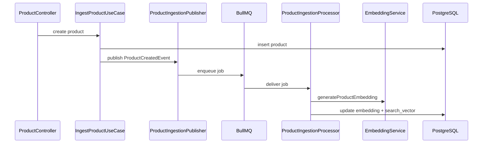

# Workers e Pipeline de Fila

## Fila

- Nome: `product-ingestion`
- Tipo de job: `ProductCreatedEvent`
- Job name no BullMQ: `ProductCreatedEvent`
- JobId determinístico: `product-created-<productId>`

## Fluxo de Ingestão Assíncrona

## Estados publicados no stream

Canal Redis por produto:

- `product:ingestion:status:<productId>`

Último estado persistido:

- `product:ingestion:latest:<productId>`

Estados:

- `queued`
- `processing`
- `completed`
- `failed`

Payload de evento:

- `productId`
- `status`
- `at`
- `message` (opcional)

## Confiabilidade

- retries automáticos no enqueue: `attempts: 5`
- backoff exponencial no BullMQ: `delay inicial = 1000ms`
- idempotência por `jobId` determinístico (evita duplicação de job para o mesmo produto)
- `removeOnComplete: true` para reduzir acúmulo de jobs concluídos
- em falha, worker publica status `failed` e relança erro para controle de retry

## Operação

- Processo worker: `npm run start:worker:dev` (dev) ou `npm run start:worker` (execução simples)
- Em Docker, o serviço `worker` é iniciado junto da stack e depende de `postgres` + `redis` saudáveis
