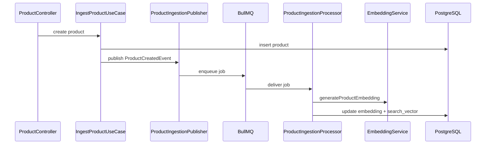

# Workers e Pipeline de Fila

## Fila
- Nome: `product-ingestion`
- Tipo de job: `ProductCreatedEvent`

## Fluxo de Ingestão Assíncrona

## Confiabilidade
- retries com backoff exponencial
- idempotência via `jobId` determinístico
- falhas registradas para replay
